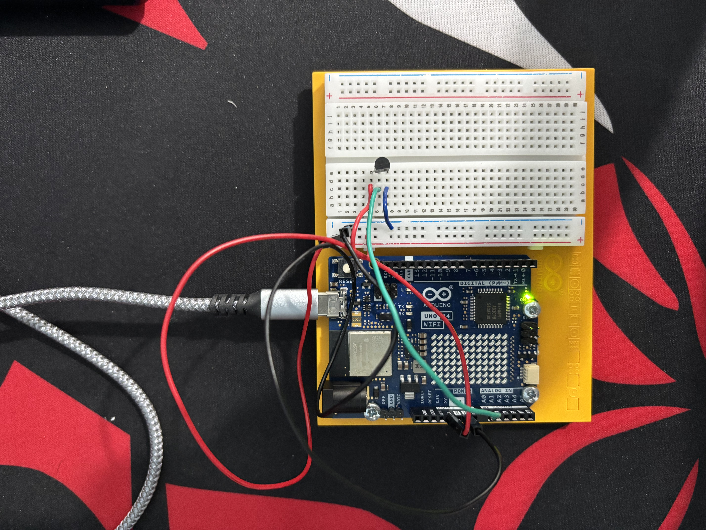
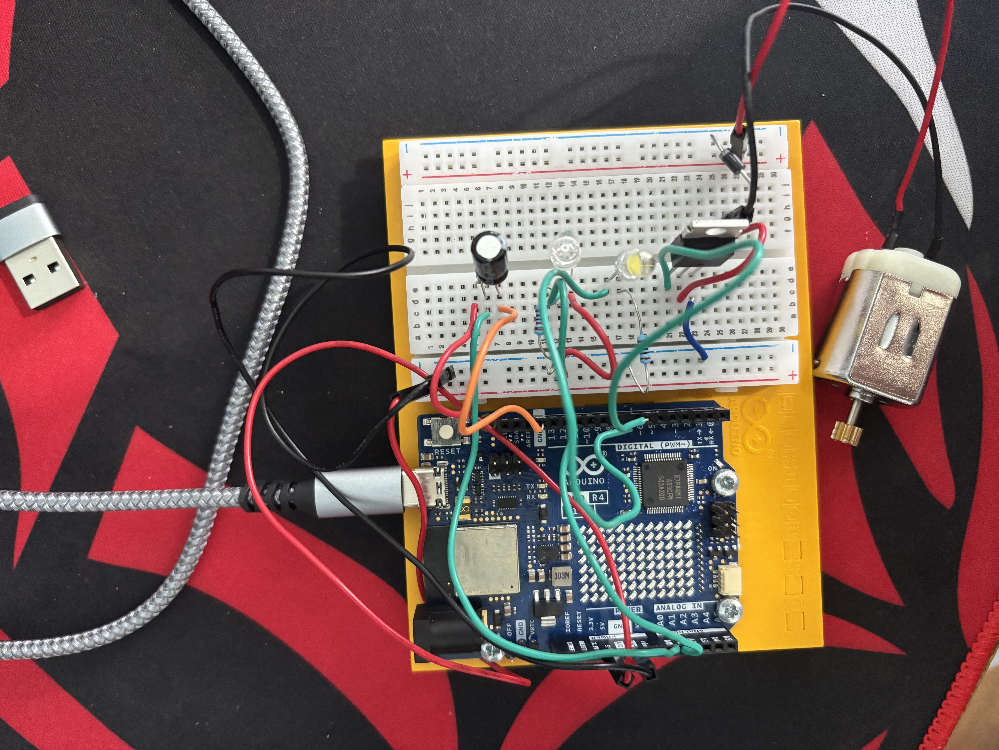
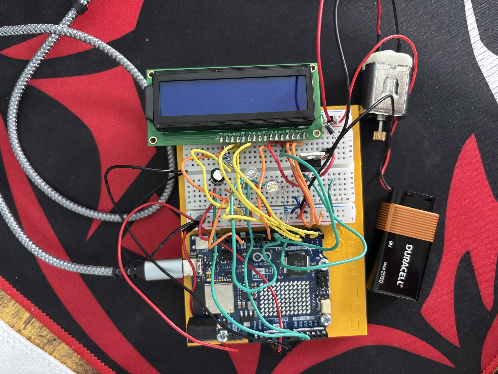

# Smart Room Environmental Controller

## Project Description

The Smart Room Environmental Controller is an Arduino-based system designed to monitor environmental conditions and automatically respond to changes in temperature and room brightness.

The system uses an Arduino UNO R4 WiFi to collect data from a temperature sensor and light sensor. Based on these readings, the Arduino automatically controls an LED that represents room lighting and a DC motor with a fan that represents a cooling system. A 16x2 LCD displays the current temperature and the status of the fan and lighting system.

I built this project to gain hands-on experience with electrical engineering concepts including sensors, breadboard circuits, analog and digital signals, motor control, automated control logic, testing, debugging, and hardware/software integration.

The project demonstrates how environmental sensor data can be processed by a microcontroller to automatically control physical devices without requiring constant user input.

---

## Features

- Real-time temperature monitoring
- Real-time ambient light monitoring
- Automatic room lighting based on light level
- Automatic cooling fan based on temperature
- 16x2 LCD status display
- Serial Monitor output for debugging and sensor readings
- Adjustable temperature and light thresholds
- Sensor testing and calibration
- Modular code organized into separate functions

---

## Hardware Used

- Arduino UNO R4 WiFi
- Breadboard
- Temperature sensor
- Phototransistor/light sensor
- LED
- Resistors
- DC motor
- Fan blade
- MOSFET/transistor for motor control
- Protection diode
- 16x2 LCD
- Jumper wires
- 9V battery and battery connector for the motor circuit
- USB-C cable

---

## System Architecture

The system uses two environmental sensors as inputs. The Arduino processes their readings and automatically controls the appropriate outputs.

```text
Temperature Sensor ───────┐
                          │
                          ▼
                  ┌─────────────────┐
Light Sensor ────►│ Arduino UNO R4  │
                  │      WiFi       │
                  └────────┬────────┘
                           │
                ┌──────────┼──────────┐
                │          │          │
                ▼          ▼          ▼
               LED        Fan        LCD
               │           │          │
               ▼           ▼          ▼
             Room        Cooling     Status
            Lighting      System     Display
```

### Inputs

- Temperature sensor
- Light sensor

### Controller

- Arduino UNO R4 WiFi

### Outputs

- LED room-light indicator
- DC motor/fan
- 16x2 LCD

---

## How the System Works

### Temperature Monitoring

The Arduino continuously reads the temperature sensor through analog pin A0.

The analog sensor reading is converted into a temperature value in Fahrenheit. A calibration offset is applied based on comparison with a reference temperature measurement.

The measured temperature is then compared with a predefined fan threshold.

If the temperature rises above the threshold, the Arduino activates the motor-control circuit and turns on the fan.

If the temperature is below the threshold, the fan remains off.

### Automatic Lighting

The light sensor is connected to analog pin A1.

The Arduino continuously measures the ambient light level and compares the reading with a predefined light threshold.

When the measured light level indicates that the room is dark, the Arduino turns the LED on.

When the room is sufficiently bright, the Arduino turns the LED off.

### Fan Control

The DC motor represents an automatic room cooling fan.

Because a motor requires more power than an Arduino digital output should directly provide, the motor is controlled through a separate motor-control circuit using a transistor/MOSFET and a protection diode.

Arduino digital pin D6 provides the control signal for the motor circuit.

The motor is activated automatically when the measured room temperature exceeds the selected temperature threshold.

### LCD Display

The 16x2 LCD provides a physical interface for viewing the current state of the Smart Room without needing to rely entirely on the Arduino IDE Serial Monitor.

The LCD displays information including:

- Current temperature
- Fan status
- Room-light status

---

## Pin Assignments

| Component | Arduino Pin |
|---|---|
| Temperature Sensor | A0 |
| Light Sensor | A1 |
| LED | D8 |
| Motor Control | D6 |
| LCD RS | D7 |
| LCD Enable | D9 |
| LCD D4 | D2 |
| LCD D5 | D3 |
| LCD D6 | D4 |
| LCD D7 | D5 |

---

## Control Thresholds

The current program uses the following control thresholds:

| Setting | Value |
|---|---:|
| Light Threshold | 260 |
| Fan Temperature Threshold | 65°F |

The light threshold determines when the Arduino considers the room dark enough to activate the LED.

The temperature threshold determines when the Arduino activates the cooling fan.

These values can be adjusted in the program as the system is tested under different environmental conditions.

---

## Software Structure

The Arduino program is divided into separate functions to make the system easier to understand, debug, and modify.

The main loop follows this general process:

```text
Read Sensors
     ↓
Control Lighting
     ↓
Control Fan
     ↓
Report Status to Serial Monitor
     ↓
Update LCD
     ↓
Repeat
```

The program includes separate functions for:

- `readSensors()` — Reads the temperature and light sensors
- `controlLighting()` — Determines whether the LED should be on or off
- `controlFan()` — Determines whether the fan should be on or off
- `printStatus()` — Reports sensor readings and system status through Serial Monitor
- `updateLCD()` — Displays system information on the LCD

Separating the program into functions makes it easier to troubleshoot individual parts of the system and add additional features later.

---

## Testing

The project was developed incrementally rather than assembling the complete system all at once.

Each major component was tested individually before being integrated into the full system.

Testing included:

- Temperature sensor readings
- Temperature conversion and calibration
- Light sensor readings under different lighting conditions
- Automatic LED activation
- DC motor operation
- Temperature-controlled fan activation
- LCD output
- Serial Monitor output
- Complete system operation

Detailed testing and calibration information is documented in:

`docs/testing.md`

---

## Challenges and Debugging

Several problems occurred during development and required troubleshooting.

### Breadboard Wiring

As more components were added to the system, the breadboard became increasingly complex. Connections had to be checked carefully to make sure components shared the correct rows, power connections, and ground connections.

Building and testing individual subsystems before integrating them helped isolate wiring problems.

### Motor Control

The DC motor required a motor-control circuit rather than being controlled directly from an Arduino digital output.

The motor circuit uses a transistor/MOSFET and protection diode, while the Arduino provides the control signal.

The motor system was tested separately before being connected to the temperature-control logic.

### LCD Wiring

The LCD initially powered on without displaying the expected text.

Troubleshooting included checking the LCD's RS, Enable, RW, data, power, ground, and contrast connections.

The Arduino `LiquidCrystal` pin assignments also needed to exactly match the physical LCD wiring.

### Sensor Calibration

Raw sensor measurements did not automatically correspond to ideal control thresholds.

Temperature and light readings were observed and compared under different conditions so the system's thresholds and temperature calculation could be adjusted.

### Code Organization

As more components were added, keeping all of the control logic inside the main `loop()` function became increasingly difficult to manage.

The program was reorganized into separate functions for sensor readings, lighting control, fan control, Serial Monitor reporting, and LCD updates.

This made the program easier to read, debug, and expand.

---

## Development Process

The Smart Room was built incrementally.

### Version 0.1 — Temperature Monitoring

The temperature sensor was connected and tested using the Arduino Serial Monitor.

### Version 0.2 — Light Monitoring

A light sensor was added so the Arduino could monitor ambient room brightness in addition to temperature.

### Version 0.3 — Automatic Lighting

An LED was added and programmed to automatically respond to the light sensor.

### Version 0.4 — Automatic Fan

A DC motor and motor-control circuit were added. The Arduino was programmed to automatically activate the fan when the temperature exceeded the selected threshold.

### Code Refactoring

The program was reorganized into separate functions to make the code easier to understand and maintain.

### Version 0.5 — LCD Display

A 16x2 LCD was added to display environmental readings and system status.

### Final Integration

The sensors, automatic lighting, cooling fan, LCD, and software were combined into a single Smart Room Environmental Controller.

---

## Photos

### Initial Prototype



### Intermediate Prototype



### Final Build



---

## Repository Structure

```text
smart-room-environment-controller/
│
├── README.md
│
├── src/
│   └── smart_room/
│       └── smart_room.ino
│
├── experiments/
│
├── docs/
│   ├── testing.md
│   └── system-design.md
│
└── images/
    ├── prototype-v0.1.jpg
    ├── prototype-v0.4.jpg
    └── final-build.jpg
```

---

## Future Improvements

The current project focuses on creating a functional automated environmental controller. Several features could be added in future versions.

Possible improvements include:

- Using the UNO R4 WiFi's wireless capabilities
- Creating a web-based monitoring dashboard
- Adding humidity monitoring
- Adding a motion/occupancy sensor
- Adding an air-quality sensor
- Recording environmental data over time
- Creating a physical model room or enclosure
- Improving sensor calibration
- Adding automatic blinds using a servo motor
- Creating a mobile-friendly monitoring interface

A future Version 2.0 could take advantage of the UNO R4 WiFi's networking capabilities to allow environmental conditions and system status to be viewed remotely.

---

## Project Status

Core Smart Room Environmental Controller development completed.

The system integrates environmental sensing, automatic control, motor control, and a physical status display into a single Arduino-based prototype.
